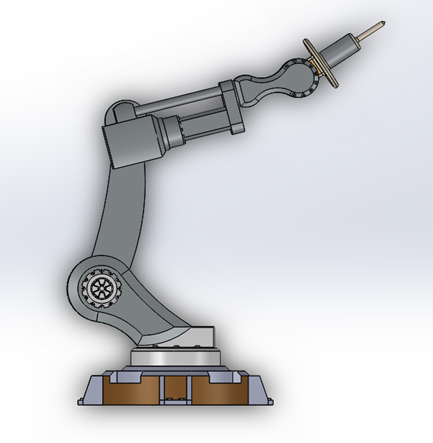
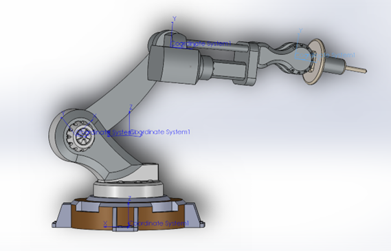
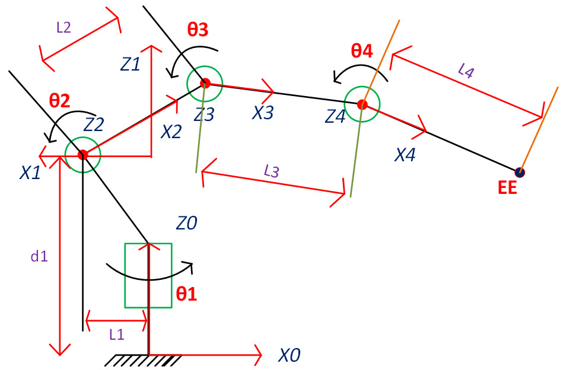
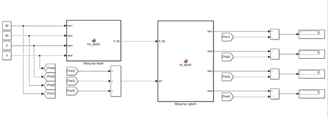
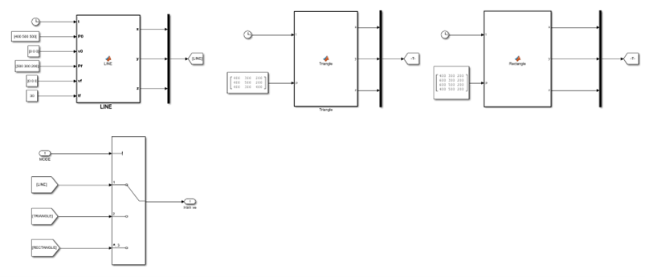
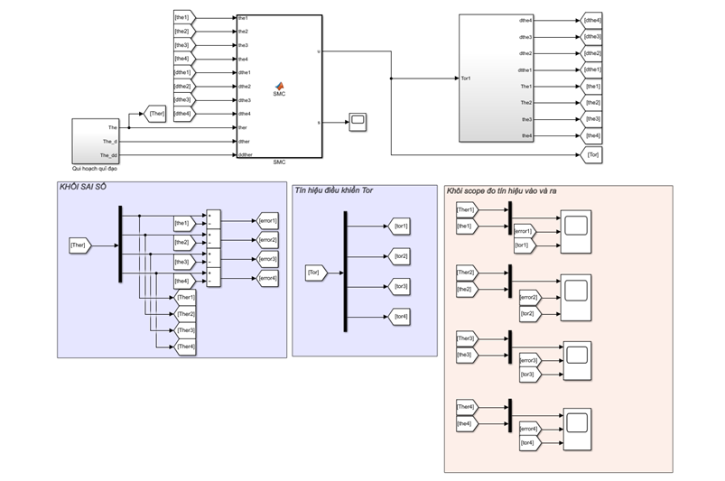
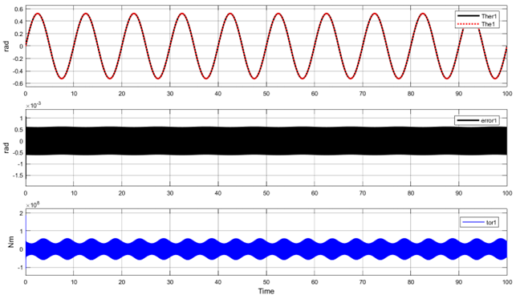
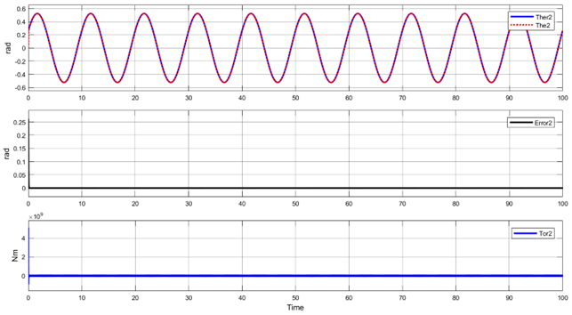
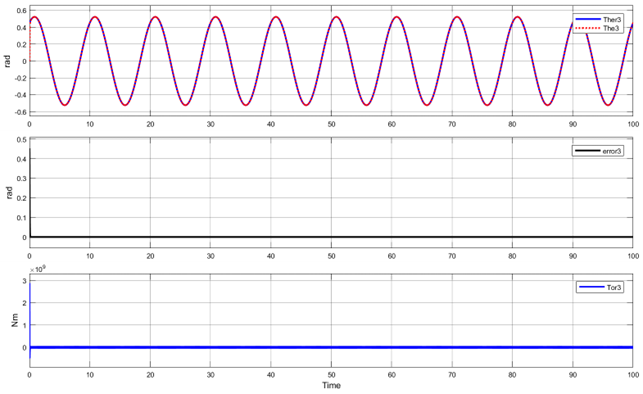
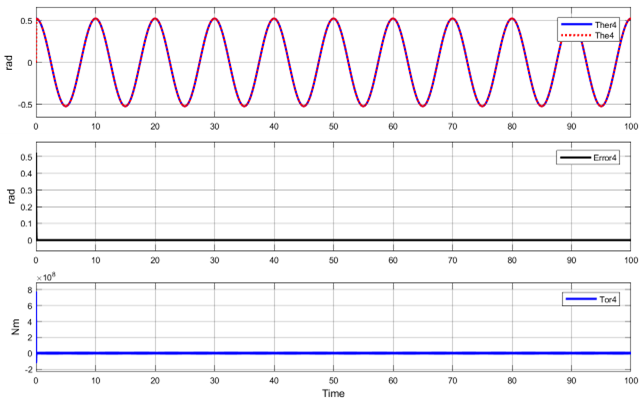

 <h1 align="center">4-DOF Robot Arm</h1>

# Introduction
This project implements the design of a serial robot with 4 degrees of freedom in Solidworks. Then calculate the forward and reverse kinematics for the 4-degree-of-freedom robot, plan the robot's trajectory using the 3rd degree polynomial. Calculate the 4-DoF robot dynamics and apply the Sidling Mode Cotrol controller and simulate controller using matlab simulink. Finally, perform 4-DOF robot simulation through Simscape Multibody and build a robot control GUI on Matlab.

# Design a 4-DOF robot arm model
The 4-degree-of-freedom robot arm model is designed on SolidWorks software as shown below:

   
  <i>Robot 4-DOF in Solidworks</i>

   
  <i>Set axes for robots on Solidworks</i>

# Calculation and kinematic testing for 4-DOF robot
* The purpose of the forward kinematics problem is to determine the position of the final action of the manipulator when the joint variables of the manipulator are known.
* The purpose of the inverse kinematics problem is to find the joint variables of the manipulator when the position of the last action of the manipulator is known. There are two methods to solve the inverse kinematics problem: the geometric method and the algebraic method.

   
  <i>Coordinate axes of robot 4-DOF</i>

Bảng Denavit- Hartenberg:

| i  | a     | alpha     | d    | theta    |
|-----|:----------:|:----------:|:----------:|:----------:|
| 1   | 0 | 0 | d1 | theta1 | 
| 2   | L1 | -90 | 0 | theta2 |
| 3   | L2 |  0 | 0 | theta3 |
| 4   | L3 |  0 | 0 | theta4 |

*	Check the results of kinematics on Matlab Simulink

   
  <i>Kinetic verification using Simulink</i>

# Planning robot orbits by polynomial of degree 3
Trajectory planning 3 forms: line, triangle, rectangle.

   
  <i>Simulink simulation planning the trajectory of basic lines</i>

# Design a Sliding Mode Control controller for a 4-DOF robot and simulate the controller using Matlab/Simulink

   
  <i>Simulink matlab simulation about controller about SMC</i>

Simulation results:

   
  <i>Input and output signal, error and torque of joint 1</i>

   
  <i>Input and output signal, error and torque of joint 2</i>

   
  <i>Input and output signal, error and torque of joint 3</i>

   
  <i>Input and output signal, error and torque of joint 4</i>

# Video
Detailed instructions for calculating forward and reverse kinematics, calculating dynamics, designing a 4-DOF robot model on SolidWorks software, designing a control interface on Matlab and control robot 4-DOF on Matlab/Simulink as follows: https://youtu.be/2O5ng-0RMgc
